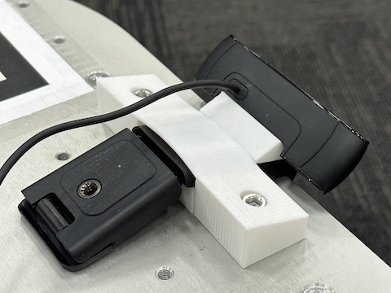
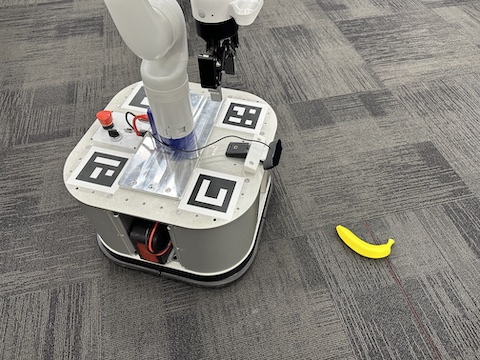
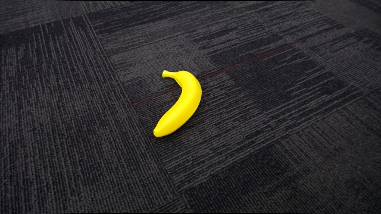

# Robot

## Setup

The following steps should be run on the mobile base computer:

1. Clone this repository:

    ```bash
    git clone https://github.com/jimmyyhwu/tidybot.git
    ```

2. Download the Kinova Gen3 Python API (`kortex_api-2.3.0.post34-py3-none-any.whl`) from the [Kortex repo](https://github.com/Kinovarobotics/kortex)

3. Set up a new Conda environment (this is different from the Conda env on the server):

    ```bash
    conda create -n tidybot python=3.9.12
    conda activate tidybot
    conda install numpy==1.23.1
    pip install kortex_api-2.3.0.post34-py3-none-any.whl
    pip install -r requirements.txt
    ```

    Note: Use the [`requirements.txt`](requirements.txt) in this directory.

4. Enable access to the egocentric camera:

    ```bash
    sudo cp 99-webcam.rules /etc/udev/rules.d/99-webcam.rules
    sudo udevadm control --reload-rules
    sudo service udev restart
    sudo udevadm trigger
    ```

5. Get the serial number of the camera using either of the following commands:

    ```bash
    lsusb -v -d 046d:0843 | grep iSerial
    udevadm info -n video0 | grep ID_SERIAL_SHORT
    ```

6. Allow members of the `realtime` group to set real-time priority for processes (such as for [`kinova.py`](kinova.py)):

    ```bash
    sudo cp 99-realtime.conf /etc/security/limits.d/99-realtime.conf
    sudo addgroup realtime
    ```

7. Add the current user to the `realtime` group:

    ```bash
    sudo usermod -aG realtime $USER
    ```

    Note that these changes do not take effect until after the current user logs out and logs back in.

8. Modify [`constants.py`](constants.py) to reflect your setup. These values may potentially need to be modified:

    * `SERVER_HOSTNAME`
    * `ROBOT_HOSTNAME_PREFIX`
    * `REDIS_PASSWORD`
    * `ARM_HEADING_COMPENSATION`
    * `CAMERA_SERIALS`

9. See the [`driver`](driver) directory for mobile base driver setup

## Camera Setup

To set up the egocentric camera, 3D print the following camera mount parts from the [stl](../stl) directory:

* [`robot-camera-mount-top.stl`](../stl/robot-camera-mount-top.stl)
* [`robot-camera-mount-bottom.stl`](../stl/robot-camera-mount-bottom.stl)
* [`robot-camera-mount-shim.stl`](../stl/robot-camera-mount-shim.stl)

The camera mount assembly is secured to the top plate of the mobile base using two M6 socket cap screws.

When fully assembled, the mounted camera looks like this:


:---:

See the server [`README`](../server/README.md) for instructions on calibrating the camera for intrinsics. Please calibrate any new cameras and place the output camera parameters in the [`camera_params`](camera_params) directory.

## Usage

See the "TidyBot Quickstart" section of the main [`README`](../README.md) for general usage instructions. The following sections describe commands that may be useful for debugging components of the robot.

### Controller

For debugging issues with the base controller or arm controller, the code automatically loads dummy controllers if there are any issues loading the real ones:

* `DummyBaseController` will be used if the code cannot communicate with the motors (e.g., the motors are off)
* `DummyArmController` will be used if the code cannot communicate with the arm (e.g., the arm is turned off)

These dummy controllers are useful for testing out server code without actually having to wait for the robot to physically move. To use them, just run `controller.py` on the mobile base computer without turning on the motors and/or the arm.

### Arm

For debugging issues with the arm, the arm API can be used directly:

```bash
python kinova.py
```

### Camera

For debugging issues with the egocentric camera, a camera server can be used to stream image frames to a client.

First, on the mobile base computer, launch the camera server:

```bash
python camera.py
```

Then, on the workstation, launch the camera client ([`robot_camera_client.py`](../server/robot_camera_client.py)) to view the live image feed:

```bash
python robot_camera_client.py --robot-num <robot-num>
```

Here is an example of what that might look like:

 | 
:---: | :---:
