# Server

## Setup

The following steps should be run on the workstation:

1. Clone this repository:

    ```bash
    git clone https://github.com/jimmyyhwu/tidybot.git
    ```

2. Set up a Conda environment called `tidybot`:

    ```bash
    conda create -n tidybot python=3.9.12
    conda activate tidybot
    conda install numpy==1.23.1
    conda install pytorch==1.12.1=py3.9_cuda11.3_cudnn8.3.2_0 cudatoolkit=11.3 -c pytorch
    pip install -r requirements.txt
    cd shortest_paths
    python setup.py build_ext --inplace
    ```

3. Set up a second Conda environment called `vild` for the object detection server (which runs ViLD and CLIP):

    ```bash
    conda create -n vild python=3.9.12
    conda activate vild
    conda install cudatoolkit=11.2 cudnn=8.1.0 -c conda-forge
    pip install numpy==1.23.1 scipy==1.9.1 pycocotools==2.0.5 lvis==0.5.3 opencv-contrib-python==4.6.0.66 Pillow==9.2.0 google-auth==2.10.0
    pip install torch==1.12.1+cu113 torchvision==0.13.1+cu113 --extra-index-url https://download.pytorch.org/whl/cu113
    pip install git+https://github.com/openai/CLIP.git
    pip install tensorflow==2.9.2
    pip install gsutil==5.14 easydict==1.10 pyyaml==6.0 jupyter==1.0.0
    ```

## Usage

The following sections describe the process of setting up marker detection and object detection from scratch. To get started with a setup that already works, see the "TidyBot Quickstart" section of the main [`README`](../README.md).

We use two ceiling-mounted overhead cameras to detect fiducial markers installed on robots in the scene to get real-time 2D robot poses with centimeter-level precision. We use the [Logitech C930e webcam](https://www.amazon.com/Logitech-C930e-1080P-Video-Webcam/dp/B00CRJWW2G). Note that even though the C930e supports 1080p, we run it at 720p, as we found that 720p is faster and was sufficient to get centimeter-level accuracy.

The code uses the serial number of your camera as an identifier for `cv.VideoCapture` and for saving and loading camera parameters. On Ubuntu 20, you can get the serial number of your camera using either of the following commands:

```bash
lsusb -v -d 046d:0843 | grep iSerial
udevadm info -n video0 | grep ID_SERIAL_SHORT
```

### Camera Calibration

In order to do accurate marker detection, the cameras need to be calibrated for intrinsics. We use the ChArUco board to calibrate our cameras. You can generate a printable ChArUco board using the following command, which outputs a PDF file to [`printouts/charuco-board.pdf`](printouts/charuco-board.pdf).

```bash
python create_charuco_board.py
```

After printing, be sure to check that the squares are actually 24 mm wide, as some printers will rescale the document.

---

To run calibration, we provide a script based on the [official example](https://github.com/opencv/opencv_contrib/blob/master/modules/aruco/samples/calibrate_camera_charuco.cpp). Run the following command, replacing `<serial>` with your camera's serial:

```bash
python calibrate_charuco.py --serial <serial>
```

It is important that the ChArUco board be kept as flat as possible (by using a clipboard, for example). After calibration, the computed camera parameters will be saved to a config file in [`camera_params`](camera_params).

For more information on camera calibration with ChArUco boards, please see the [official tutorial](https://docs.opencv.org/4.6.0/da/d13/tutorial_aruco_calibration.html). You may also find [this list](https://calib.io/blogs/knowledge-base/calibration-best-practices) (backup [here](calibration-best-practices.txt)) of calibration best practices to be helpful.

### Marker Detection

To create printable markers for the 3 mobile bases, run the following command, which will generate printable markers at [`printouts/markers.pdf`](printouts/markers.pdf).

```bash
python create_markers.py
```

The printout contains 4 markers per mobile base for a total of 12 markers. The 12 marker IDs used were empirically found to be the most easily detected among the set of all markers in `cv.aruco.DICT_4X4_50`.

As with the ChArUco board, be sure to measure the printed markers in case the document was rescaled during printing. The markers should be exactly 90 mm wide.

---

The [`detect_markers.py`](detect_markers.py) script (see [tutorial](https://docs.opencv.org/4.6.0/d5/dae/tutorial_aruco_detection.html)) will detect markers visible in the camera image, and is useful for verifying marker IDs and marker orientations. To use it, run the following command, again replacing `<serial>` with your camera's serial:

```bash
python detect_markers.py --serial <serial>
```

Here are examples of what `detect_markers.py` might detect from the overhead images:

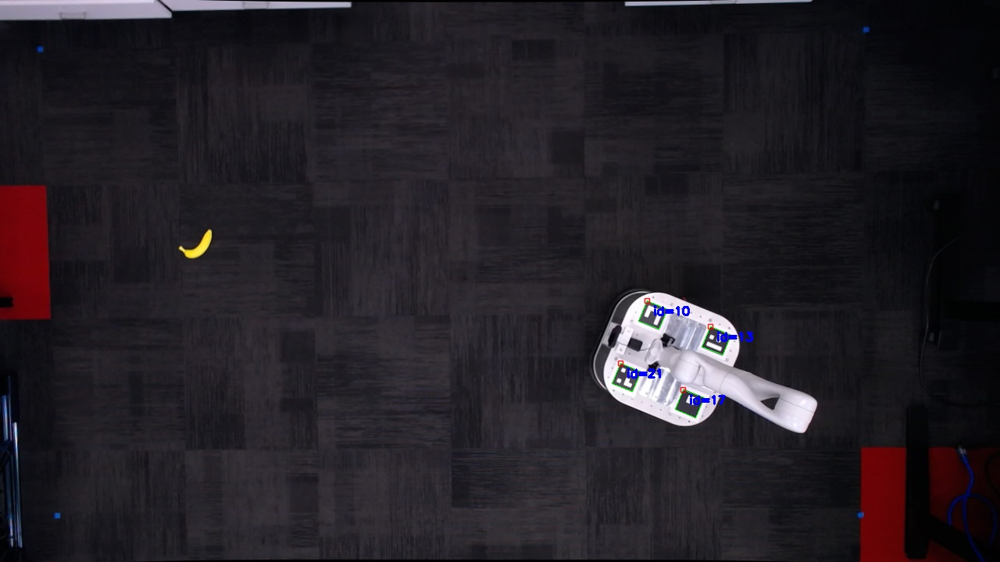 | 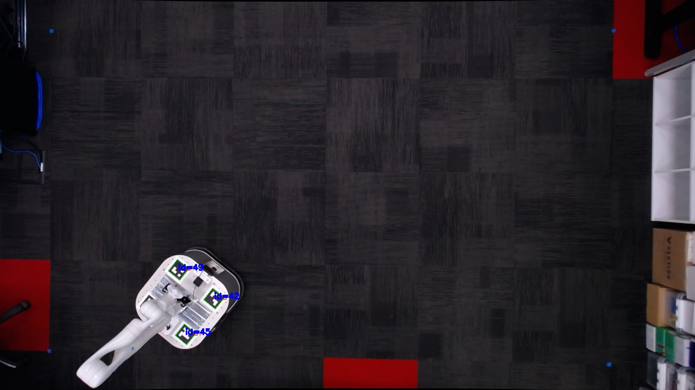
:---: | :---:

### Camera Alignment

Our marker detection setup is capable of detecting 2D robot poses with centimeter-level precision. However, it is *very* important that the overhead cameras are set up and aligned correctly. Otherwise, the accuracy may suffer.

We use the following 3D-printed parts from the [stl](../stl) directory to mount the overhead cameras:

* [`ceiling-camera-mount.stl`](../stl/ceiling-camera-mount.stl)
* [`ceiling-cable-clip.stl`](../stl/ceiling-cable-clip.stl)

We mount the cameras such that they each cover half of the floor space. Here are some photos of what our cameras look like when mounted:

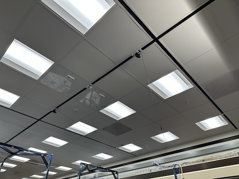 |  | 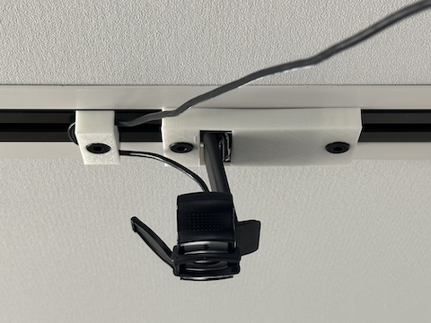
:---: | :---: | :---:

---

Once the cameras are mounted, the [`camera_alignment.py`](camera_alignment.py) script can be used to annotate the corners of the floor work area in image coordinates. The annotated corners are used to map coordinates between image space and physical space. In our setup, we used a 6x7 grid of floor tiles as our work area.

To run camera alignment for a newly mounted camera, run the following command to start the annotation interface:

```bash
python camera_alignment.py --serial <serial>
```

Inside the annotation interface, select the corners of the work area by double clicking on the corresponding pixels. To make this process easier, we recommend applying 24 mm squares of tape to make the corners more visible, and then zooming in within the annotation interface:

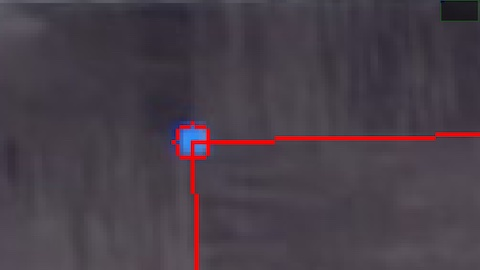
:---:

Note that the cameras move slightly when first turned on and stabilize after around 10 minutes of use, so it is best to "warm up" the cameras before doing camera alignment by running them for at least 10 minutes.

Here are examples of what the images look like when the cameras are first turned on:

 | 
:---: | :---:

Notice that the top left corner in particular looks very far from the red annotated position.

Here are what the images look like after the cameras have been running for 10 minutes:

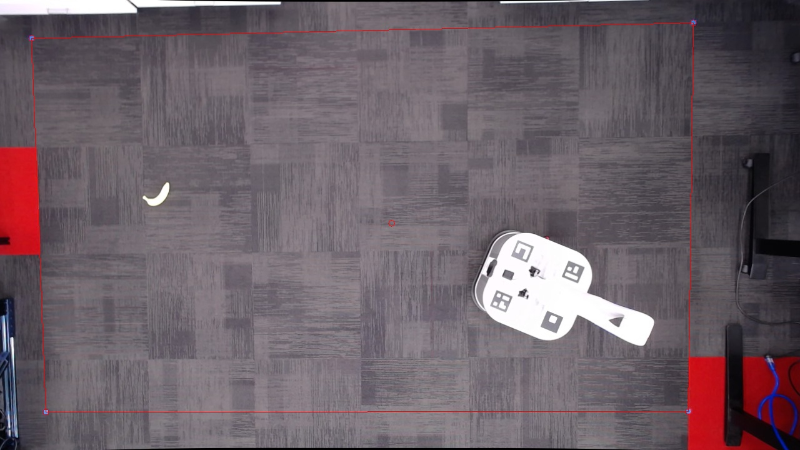 | 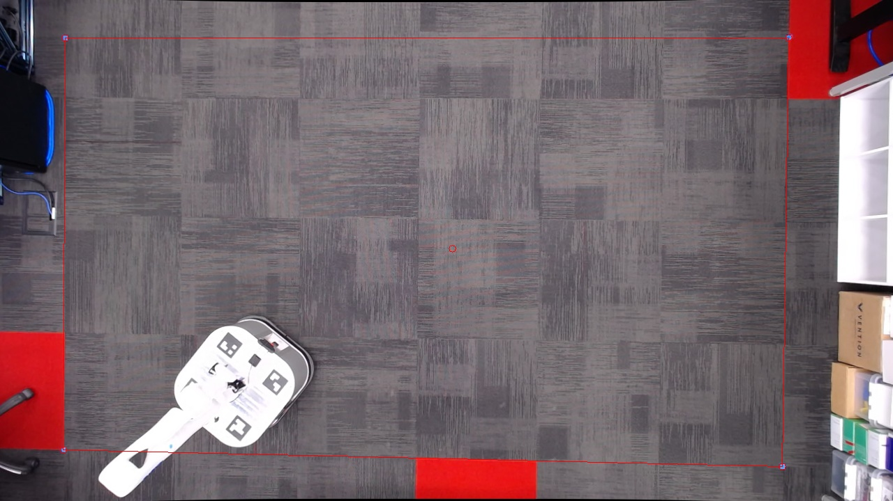
:---: | :---:

Notice that all the corners match up with their annotations now.

Note that it should not be necessary to rerun camera alignment unless the cameras are physically moved or bumped.

Rerun camera alignment

---

To validate the camera alignment, run this command to start up a camera server for each camera:

```bash
python start_camera_servers.py
```

Then, in a different terminal, run this command to start an image client that uses the annotated corners to perform perspective correction:

```bash
python image_client.py
```

The image shown in the client should look like this:

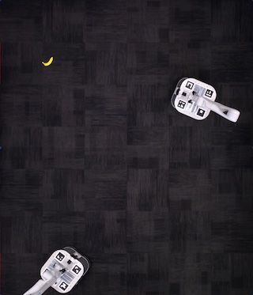
:---:

In particular, if the corners were accurately annotated, then the image would show a 6x7 grid of floor tiles with no perspective distortion.

---

After annotating the corners of the work area, we also need to annotate the camera center in image coordinates. This is used to calculate a correction when estimating the position of the mobile bases, since their markers are mounted at a height of 32.5 cm above the floor. The camera center is the location in the image where the principal axis of the camera intersects the floor. To label this location with a piece of tape, we used a RoboVector 5 Beam Self-Leveling Laser, which can find the point on the ground directly below the camera:

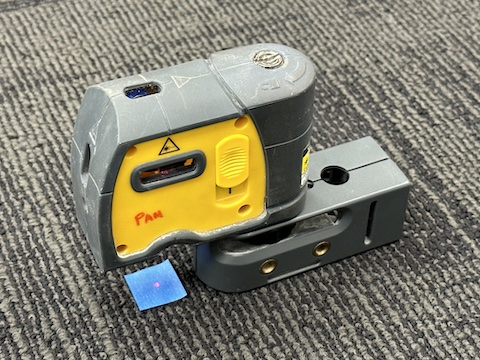
:---:

After labeling the camera center point on the floor, we run the same script again but this time with the `--center` flag:

```bash
python camera_alignment.py --serial <serial> --center
```

The large green circle is for reference only and marks the image center. Double click on the camera center to annotate it with a red circle. A correctly annotated camera center should look like this:

 | 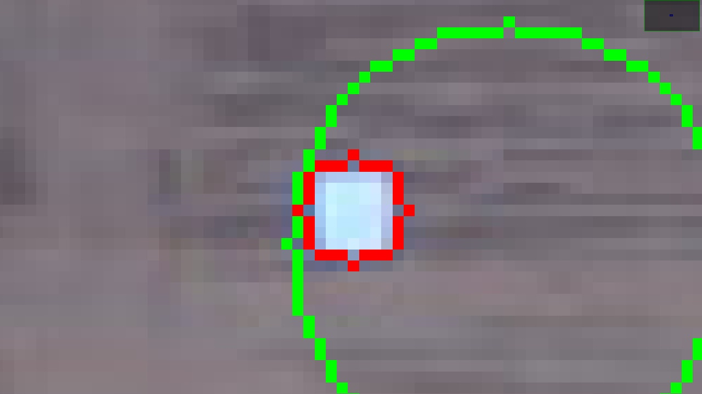
:---: | :---:

### Robot Marker Detection

Since the Kinova arm on the mobile base can occlude fiducial markers installed on the top plate, we opt to use 4 markers instead of 1. We then estimate the 2D pose of each mobile base by aggregating predictions from the non-occluded markers.

Here are the marker IDs used for each of the mobile bases:

* Mobile base #1: `10`, `13`, `17`, `21`
* Mobile base #2: `23`, `30`, `37`, `41`
* Mobile base #3: `42`, `45`, `48`, `49`

See this image for marker placement:

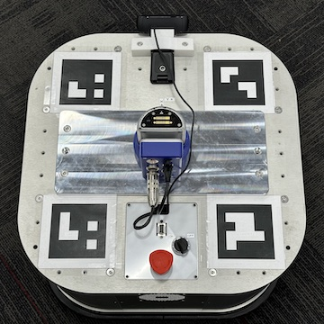
:---:

The markers are placed by first orienting the mobile base with positive x pointing right and then installing the markers in ID order starting from the top left and going clockwise. It is important that the markers are placed as accurately as possible.

---

To run marker detection, first start the marker detector server:

```bash
python marker_detector_server.py
```

Then, in a separate terminal, start the marker detector client:

```bash
python marker_detector_client.py
```

The visualization of estimated robot poses should look like this:

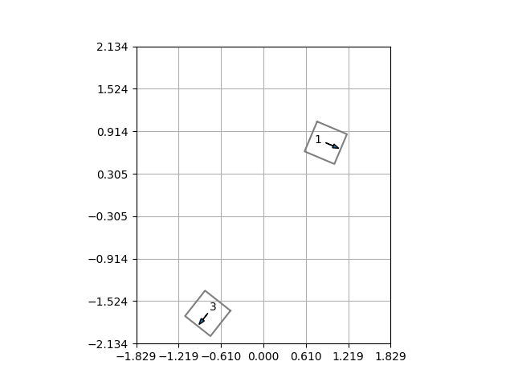
:---:

The grid in the visualization corresponds with the actual tiles on the floor. Note that the positive x-direction for the mobile base is 180 degrees opposite that of the arm.

For additional debugging visualization, enable the `--debug` flag:

```bash
python marker_detector_server.py --debug
```

```bash
python marker_detector_client.py --debug
```

The debugging visualization shows how the 4 individual marker poses are aggregated to get the overall pose of the robot:

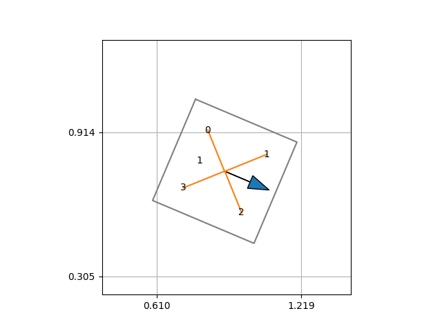
:---:

### Object Detection

The object detector server should be run using the `vild` Conda environment:

```bash
conda activate vild
python object_detector_server.py
```

This server takes in input images and runs either ViLD or CLIP on them.

In a separate terminal, start the object detector client:

```bash
python object_detector_client.py
```

This client will capture overhead images and send them to the server.

To visualize the object detections, use the `--debug` flag:

```bash
python object_detector_server.py --debug
```

This should show an object detection visualization that looks like this:

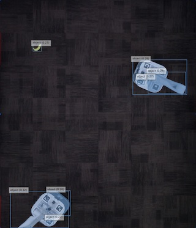
:---:

We can also visualize CLIP predictions on robot egocentric images. On the mobile base computer, start a camera server with [`camera.py`](../robot/camera.py):

```bash
python camera.py
```

Then, on the workstation, launch the camera client ([`robot_camera_client.py`](robot_camera_client.py)) to view the live image feed:

```bash
python robot_camera_client.py --robot-num <robot-num>
```

The `robot_camera_client.py` script (running on the workstation) will forward the received images from the robot to the object detector server.

With `--debug` enabled, the CLIP prediction looks like this:

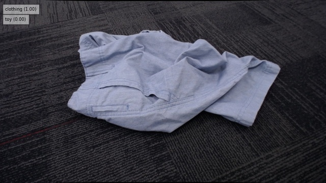
:---:

### LLM Summarization

To run the LLM pipeline for generating summarized preferences from examples, see the [`summarization.ipynb`](summarization.ipynb) notebook. This pipeline can be used to generate receptacle selection and primitive selection rules (preferences) for new scenarios.
